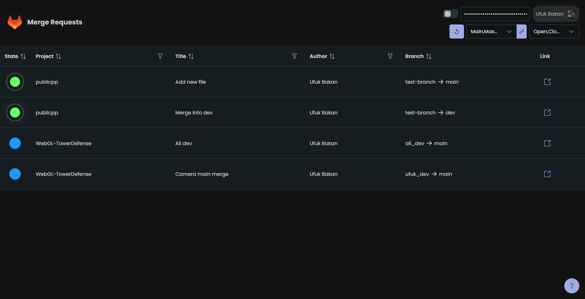

# Gitlab Merge Request Monitor

## What is it
This web application provides a GUI for team leads, system administrators and devops crew to view all merge requests at a glance.

You need to get an access token to use gitlab api.

___
### How to get an access token

#### Method 1
- Click on the "Sign In" button that located on the top right corner
- Follow instructions, you will be redirected back to home page

#### Method 2
- Sign in to your GitLab account
- Click on your user <u>profile picture</u>
- Go to <u>Preferences</u>
- Go to <u>Acces Tokens</u> page via side bar
- Under the section <u>Add a personal access token</u>; give it a name, define expiration date and <u>read_api permission</u>
- Scroll down a little bit to click on <u>Create personal access token</u> button
- After creating it, access token is just below heading <u>Your new personal access token</u>
- Copy it and save at somewhere safe because you won't be able to reread your access token, you can only delete it.

### How to install on-premise

- Clone project from <a href="https://github.com/ufukbakan/gitlab-mr-monitor" target="_blank">https://github.com/ufukbakan/gitlab-mr-monitor</a>
- You can edit source code to change base url, branches and scope

    If you want to do so open project via any text editor.
    Look for the <u>.env</u> file, it will help you to find api configs.

- Install dependencies via your package manager. (e.g. npm install)
- You can then run 'dev' script or build and serve it as a standard React project.
